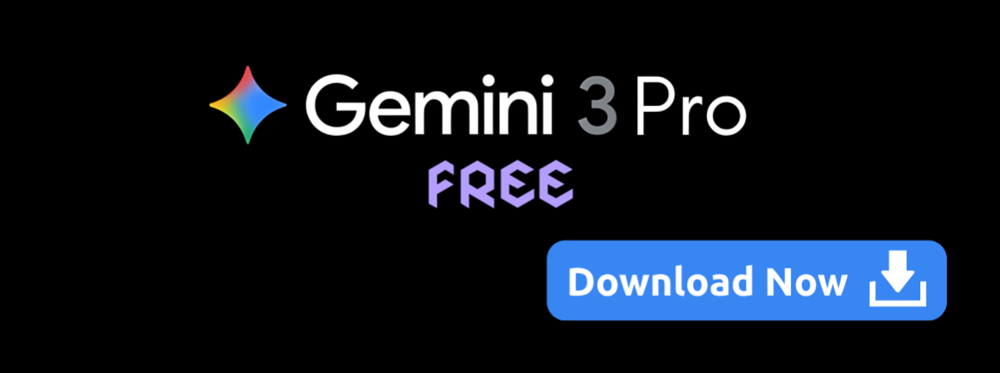

# Gemini 3 Pro — Free

<div align="center">
  <a href="../../releases/latest">
    
  </a>
</div>

> **Unlimited, free-first AI toolkit** — Gemini 3 Pro Free bundles Gemini 3 Pro, Nano Banana Pro, and Veo 3.1 with unmetered access to Google AI Studio. No accounts, no token limits — create images, videos, and multimodal content freely.

## ✨ As part of our **early access program**, the application is available **completely free for all users until December 31** ✨

We highly appreciate your feedback — feel free to submit suggestions and issue reports via [Issues](../../issues).

Users who help us improve the product (by finding bugs, reporting problems, or sharing valuable ideas) will receive an **exclusive 80% discount on the ULTRA subscription** — available for either **monthly or yearly** plans.

Additionally, the **top contributor** of the early access period will receive a **free 1-year ULTRA subscription**.

**ULTRA** provides full, unrestricted access to all AI models.

---

## ⚡ Quick highlights

* **Truly free generation pipeline**: unlimited image & video creation with Gemini 3 Pro, Nano Banana Pro and Veo 3.1 — no monthly bills and no token caps.
* **Creator-focused**: simple launcher, preset library, templates for photo/video, example projects for quick start.
* **Full multimodal stack**: text, vision, video, workflows and automation.

---

## ✨ Features

* ✅ **Gemini 3 Pro Free** — unrestricted text, image and multimodal generation.
* ✅ **Google AI Studio passthrough** — high-end features accessible directly.
* ✅ **Nano Banana Pro** — advanced creative image model ideal for concepts & style variations.
* ✅ **Veo 3.1** — fast video generation, loops, cinematic shorts and enhancement tools.
* 🎨 **Unlimited photo creation** — high-resolution image synthesis without per-image fees.
* 🎞️ **Free video generation** — short clips, vertical formats, loops and templates included.
* 🧩 **Presets & Templates** — portrait, product, cinematic, branding, motion, social-ready formats.

---

## 🍽️ Tasty & Cool features

* **“Create a hero shot in 3 seconds”** — one hotkey produces a polished product/portrait image using optimized presets.
* **“From prompt to TikTok”** — generate a 9:16 clip with Veo 3.1, auto-apply music and captions, export instantly.
* **“Infinite moodboards”** — generate hundreds of style directions for branding and art direction.
* **“Zero tokens, zero bills”** — create unlimited assets with no consumption limits.
* **“Smart storyboard pipeline”** — Gemini writes scenes, Nano Banana renders frames, Veo builds animatics.
* **“Batch-create product photos”** — feed a CSV and get consistent product shots for all SKUs.

---

## 🖥️ System Support

| Operating System | Architecture | Supported |
| ---------------- | ------------ | --------- |
| Windows          | x64          | ✅         |
| macOS            | Intel / ARM  | ✅         |
| Linux            | x64 / ARM64  | ✅         |

---

## 💾 Installation

1. Download the latest build from [Releases](./../releases)
2. Extract the archive into any folder you prefer.
3. On Windows: run `GemAI.exe` to finalize setup.

---

## 🧭 Quick usage (GUI + CLI)

**GUI:**
Choose a preset (Portrait / Cinematic / Product / Motion Loop), type a prompt, press **Generate**.

**CLI:**

```bash
# Generate a photorealistic portrait
./g3free --model gemini3 --preset portrait --prompt "Cinematic portrait of a female astronaut, 35mm, dramatic lighting"

# Batch-generate product shots from CSV
./g3free --batch products.csv --preset product

# Create 9:16 social clip
./g3free --model veo3.1 --preset tiktok-short --prompt "sunset beach, slow dolly" --duration 8
```

---

## 🧾 License

Released under the MIT License.
See `LICENSE`.

---

*Made with ❤️ for creators who want unlimited AI.*
